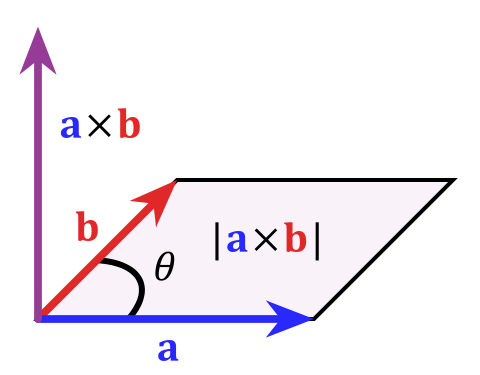
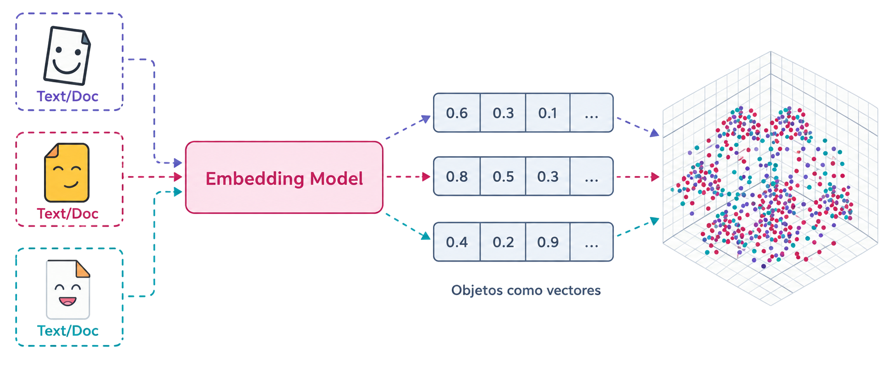
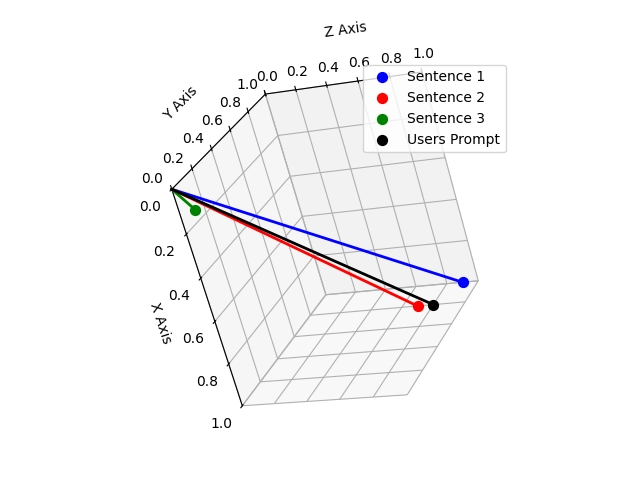

## Objetivos de la clase
En esta clase estudiaremos los vectores en $R^n$ y las operaciones que permiten medir longitudes, ángulos y direcciones. Al finalizar, el estudiante deberá ser capaz de:

- Representar y operar vectores en $R^2$, $R^3$ y $R^n$.
- Calcular e interpretar el producto interior.
- Determinar la norma, el ángulo y los vectores unitarios.
- Calcular la proyección de un vector sobre otro y descomponer ortogonalmente.
- Aplicar el producto cruz en $R^3$.
- Reconocer estas herramientas en aplicaciones de computación y en RAG.

## Vectores en Rn
Un vector en $R^n$ es una $n$-upla ordenada de números reales:
$$u=(u_1,u_2,\dots,u_n), \qquad u_i\in R.$$
Por lo tanto,
$$R^n=\{(u_1,u_2,\dots,u_n): u_i\in R\}.$$
Ejemplos:

- $(2,-1)\in R^2$.
- $(1,0,3)\in R^3$.
- $(2,-1,4,0,5)\in R^5$.

## Operaciones entre vectores
Sean $u=(u_1,\dots,u_n)$ y $v=(v_1,\dots,v_n)$. La suma se define componente a componente:
$$u+v=(u_1+v_1,\dots,u_n+v_n),$$
y la multiplicación por escalar, con $\lambda\in R$:
$$\lambda u=(\lambda u_1,\dots,\lambda u_n).$$

#### Clausura
Si $u,v\in R^n$, entonces $u+v\in R^n$; y si $\lambda\in R$, entonces $\lambda u\in R^n$. Las operaciones producen nuevamente elementos del mismo conjunto. Esta idea será fundamental al estudiar espacios vectoriales.

## Aplicaciones
Un vector puede almacenar múltiples cantidades simultáneamente. Por ejemplo,
$$x=(x_1,x_2,\dots,x_n)$$
puede representar:

- mediciones de sensores;
- velocidades o fuerzas;
- señales discretizadas;
- características de un conjunto de datos;
- estados de un sistema dinámico;
- parámetros de un modelo.

En informática, esta última interpretación es central: un texto, una imagen o un usuario se representan mediante un **vector de características** o **embedding**.

## Producto interior o producto punto
Sean $u=(u_1,\dots,u_n)$ y $v=(v_1,\dots,v_n)$. El producto interior en $R^n$ se define como
$$u\cdot v=u_1v_1+\dots+u_nv_n=\sum_{i=1}^{n}u_i v_i.$$
El resultado del producto punto es un **número real**, no un vector.

#### Ejemplo
Para $u=(3,-1,2)$ y $v=(1,4,-2)$:
$$u\cdot v=3(1)+(-1)(4)+2(-2)=3-4-4=-5.$$

## Propiedades del producto interior
Para $u,v,w\in R^n$ y $\lambda\in R$:

- $u\cdot v=v\cdot u$ (conmutatividad).
- $u\cdot(v+w)=u\cdot v+u\cdot w$ (distributividad).
- $(\lambda u)\cdot v=\lambda(u\cdot v)$ (homogeneidad).
- $u\cdot u\ge 0$, y $u\cdot u=0 \iff u=0$ (positividad definida).

## Ejercicio 1
Sean
$$u=(3,1,-2), \qquad v=(2,-3,4).$$
Realice cada uno de los siguientes pasos:

- Calcule $u+v$.
- Calcule $3u-2v$.
- Calcule $u\cdot v$.

## 
#### Suma
$$u+v=(3+2,\,1+(-3),\,-2+4)=(5,-2,2).$$

#### Combinación lineal
$$3u-2v=3(3,1,-2)-2(2,-3,4)=(9,3,-6)-(4,-6,8)=(5,9,-14).$$

#### Producto punto
$$u\cdot v=3(2)+1(-3)+(-2)(4)=6-3-8=-5.$$

## Ortogonalidad
Dos vectores no nulos son **ortogonales** si forman un ángulo de $90^\circ$. Algebraicamente,
$$u\perp v \iff u\cdot v=0.$$

#### Ejemplo
Para $u=(3,2)$ y $v=(-2,3)$:
$$u\cdot v=3(-2)+2(3)=0,$$
por lo tanto $u\perp v$.

## Ejercicio 2
Determine el valor de $k$ para que
$$u=(2,k,1), \qquad v=(1,-3,4)$$
sean ortogonales.

## 
Imponemos la condición de ortogonalidad $u\cdot v=0$:
$$u\cdot v=2(1)+k(-3)+1(4)=2-3k+4=6-3k=0.$$
Despejamos:
$$3k=6 \implies k=2.$$

## Norma de un vector
La **norma** o magnitud de un vector $u$ se define a partir del producto interior:
$$\|u\|=\sqrt{u\cdot u}.$$
Si $u=(u_1,\dots,u_n)$, entonces
$$\|u\|=\sqrt{u_1^2+\dots+u_n^2}.$$

#### Ejemplo
Para $u=(-2,3,6)$:
$$\|u\|=\sqrt{(-2)^2+3^2+6^2}=\sqrt{4+9+36}=\sqrt{49}=7.$$

## Propiedades de la norma
Para $u\in R^n$ y $\lambda\in R$:

- $\|u\|\ge 0$.
- $\|u\|=0 \iff u=0$.
- $\|\lambda u\|=|\lambda|\,\|u\|$.
- $\|u+v\|\le \|u\|+\|v\|$ (desigualdad triangular).

La norma mide la **longitud** del vector y también la distancia entre dos puntos: $\|u-v\|$.

## Vectores unitarios y normalización
Un vector $u$ es **unitario** si $\|u\|=1$. Si $u\neq 0$, se puede obtener un vector unitario con la misma dirección mediante
$$\hat{u}=\dfrac{u}{\|u\|}.$$
A este proceso se le llama **normalización**.

#### Ejemplo
Para $u=(5,12)$, su norma es $\|u\|=\sqrt{5^2+12^2}=13$. Entonces
$$\hat{u}=\dfrac{1}{13}(5,12)=\left(\dfrac{5}{13},\dfrac{12}{13}\right).$$

Al normalizar, la dirección y el sentido permanecen iguales; la magnitud se transforma en $1$.

## Ángulo entre dos vectores
Para dos vectores no nulos,
$$u\cdot v=\|u\|\,\|v\|\cos\theta.$$
Por lo tanto,
$$\cos\theta=\dfrac{u\cdot v}{\|u\|\,\|v\|}, \qquad 0\le\theta\le\pi.$$

El **signo del producto punto** clasifica el ángulo sin calcularlo:

- $u\cdot v>0 \implies \cos\theta>0 \implies \theta<90^\circ$ (agudo).
- $u\cdot v=0 \implies \theta=90^\circ$ (recto).
- $u\cdot v<0 \implies \cos\theta<0 \implies \theta>90^\circ$ (obtuso).

## Ejercicio 3
Sean
$$u=(2,1,-3), \qquad v=(1,-1,2).$$
Sin calcular explícitamente el ángulo, determine si es agudo, recto u obtuso.

## 
Calculamos el producto punto:
$$u\cdot v=2(1)+1(-1)+(-3)(2)=2-1-6=-5.$$
Como $u\cdot v<0$, el ángulo es **obtuso**.

## Ejercicio 4
Sean
$$u=(2,2,0), \qquad v=(0,3,3).$$
Calcule el ángulo entre los vectores.

## 
Calculamos el producto punto y las normas:
$$u\cdot v=2(0)+2(3)+0(3)=6,$$
$$\|u\|=\sqrt{2^2+2^2+0^2}=2\sqrt{2}, \qquad \|v\|=\sqrt{0^2+3^2+3^2}=3\sqrt{2}.$$
Entonces
$$\cos\theta=\dfrac{u\cdot v}{\|u\|\|v\|}=\dfrac{6}{(2\sqrt{2})(3\sqrt{2})}=\dfrac{6}{12}=\dfrac{1}{2},$$
por lo tanto
$$\theta=\arccos\left(\dfrac{1}{2}\right)=60^\circ.$$

## Proyección de un vector
La proyección de $u$ sobre $v$ representa la componente de $u$ en la dirección de $v$.

- **Proyección escalar:** $\operatorname{comp}_v u=\dfrac{u\cdot v}{\|v\|}$.
- **Proyección vectorial:** $\operatorname{proj}_v u=\dfrac{u\cdot v}{v\cdot v}\,v$.

#### Ejemplo
Para $u=(4,3)$ y $v=(2,-1)$ tenemos $u\cdot v=5$ y $v\cdot v=5$, entonces
$$\operatorname{proj}_v u=\dfrac{5}{5}(2,-1)=(2,-1).$$

## Descomposición ortogonal
Todo vector $u$ puede descomponerse respecto de una dirección $v$ como
$$u=\operatorname{proj}_v u+(u-\operatorname{proj}_v u).$$
La segunda componente es **ortogonal** a $v$:
$$(u-\operatorname{proj}_v u)\cdot v=0.$$

Esto separa $u$ en una parte paralela a $v$ y una parte perpendicular a $v$.

## Ejercicio 5
Sean
$$u=(3,5), \qquad v=(1,2).$$
Realice cada uno de los siguientes pasos:

- Calcule $\operatorname{proj}_v u$.
- Determine $w=u-\operatorname{proj}_v u$.
- Compruebe que $w\cdot v=0$.

## 
#### Proyección
Calculamos $u\cdot v=3(1)+5(2)=13$ y $v\cdot v=1^2+2^2=5$:
$$\operatorname{proj}_v u=\dfrac{13}{5}(1,2)=\left(\dfrac{13}{5},\dfrac{26}{5}\right).$$

#### Componente ortogonal
$$w=u-\operatorname{proj}_v u=(3,5)-\left(\dfrac{13}{5},\dfrac{26}{5}\right)=\left(\dfrac{2}{5},-\dfrac{1}{5}\right).$$

#### Comprobación
$$w\cdot v=\dfrac{2}{5}(1)+\left(-\dfrac{1}{5}\right)(2)=\dfrac{2}{5}-\dfrac{2}{5}=0.$$

## Producto cruz en R3
El producto cruz se define, en este curso, para vectores de $R^3$. Sean $u=(u_1,u_2,u_3)$ y $v=(v_1,v_2,v_3)$. Se define mediante el determinante simbólico
$$u\times v=\begin{vmatrix}\mathbf{i}&\mathbf{j}&\mathbf{k}\\ u_1&u_2&u_3\\ v_1&v_2&v_3\end{vmatrix}.$$
Equivalentemente,
$$u\times v=(u_2v_3-u_3v_2,\; u_3v_1-u_1v_3,\; u_1v_2-u_2v_1).$$
El resultado es un vector de $R^3$ y cumple $(u\times v)\perp u$ y $(u\times v)\perp v$.

## Propiedades del producto cruz
Para $u,v,w\in R^3$:

- $u\times v=-(v\times u)$ (anticommutatividad).
- $u\times u=0$.
- $u\times(v+w)=u\times v+u\times w$ (distributividad).
- $u\times v=0$ si y solo si los vectores son paralelos.

## Interpretación geométrica del producto cruz
Se cumple que
$$\|u\times v\|=\|u\|\,\|v\|\sin\theta.$$
Por lo tanto,

- $A_{\text{paralelogramo}}=\|u\times v\|$, el área del paralelogramo generado por $u$ y $v$;
- $A_{\triangle}=\dfrac{1}{2}\|u\times v\|$, el área del triángulo correspondiente.

##

::: {style="text-align:center; width:100%; margin-left: auto; margin-right: auto;"}

:::

## Ejemplo
Para $u=(2,1,0)$ y $v=(1,-1,3)$:
$$u\times v=(3,-6,-3).$$
Comprobamos la perpendicularidad:
$$(u\times v)\cdot u=3(2)+(-6)(1)+(-3)(0)=0,$$
$$(u\times v)\cdot v=3(1)+(-6)(-1)+(-3)(3)=0.$$

## Ejercicio 6
Sean
$$u=(3,1,-2), \qquad v=(2,-1,1).$$
Realice cada uno de los siguientes pasos:

- Calcule $u\times v$.
- Verifique que el resultado es perpendicular a ambos vectores.
- Determine el área del paralelogramo generado por $u$ y $v$.

## 
#### Producto cruz
$$u\times v=(1(1)-(-2)(-1),\,(-2)(2)-(3)(1),\,(3)(-1)-(1)(2))=(-1,-7,-5).$$

#### Perpendicularidad
$$(u\times v)\cdot u=(-1)(3)+(-7)(1)+(-5)(-2)=-3-7+10=0,$$
$$(u\times v)\cdot v=(-1)(2)+(-7)(-1)+(-5)(1)=-2+7-5=0.$$

#### Área
$$A=\|u\times v\|=\sqrt{(-1)^2+(-7)^2+(-5)^2}=\sqrt{1+49+25}=\sqrt{75}=5\sqrt{3}\approx 8{,}66.$$

## Similitud coseno
En computación, dos elementos se representan mediante vectores (embeddings) y se comparan con el **coseno del ángulo** entre ellos:
$$\text{sim}(u,v)=\cos\theta=\dfrac{u\cdot v}{\|u\|\,\|v\|}=\dfrac{\operatorname{comp}_v u}{\|u\|}.$$
Es decir, la similitud coseno es la **proyección escalar normalizada**. Como $|\cos\theta|\le 1$, se tiene $\text{sim}(u,v)\in[-1,1]$:

- valores cercanos a $1$ indican vectores alineados (muy similares);
- valores cercanos a $0$, vectores ortogonales (sin relación);
- valores cercanos a $-1$, vectores opuestos.

#### Idea clave
Si los vectores están normalizados, $\|u\|=\|v\|=1$, entonces $\text{sim}(u,v)=u\cdot v$: basta el producto punto.

## Aplicación: búsqueda semántica
La búsqueda tradicional compara palabras exactas. La búsqueda semántica compara **significado**:

- Cada documento o fragmento se convierte en un embedding, un vector en $R^n$.
- La consulta del usuario también se convierte en un vector.
- Se calcula la similitud coseno entre la consulta y cada documento.
- Se ordenan los documentos de mayor a menor similitud y se devuelven los primeros.

Esto convierte un problema de lenguaje en un problema **geométrico**: los vectores cercanos en dirección representan contenidos parecidos. La normalización permite precalcular normas y reducir el costo de cada comparación.

## Aplicación: RAG (Retrieval-Augmented Generation)
Un modelo de lenguaje puede "alucinar" cuando responde sin fuentes. **RAG** combina un recuperador vectorial con un generador:

- **Indexación:** se divide la base de conocimiento en fragmentos y cada fragmento se codifica como embedding.
- **Recuperación:** la consulta se codifica y se compara con todos los fragmentos usando similitud coseno; se conservan los $k$ mejores.
- **Aumento:** los fragmentos recuperados se insertan en el contexto del prompt.
- **Generación:** el modelo genera la respuesta a partir de ese contexto.

El paso de recuperación es puramente álgebra lineal: **producto interior, norma y coseno**. Sin estas operaciones no habría forma de decidir qué documentos son relevantes.

##
::: {style="text-align:center; width:100%; margin-left: auto; margin-right: auto;"}

:::

##
::: {style="text-align:center; width:100%; margin-left: auto; margin-right: auto;"}

:::

##
::: {style="text-align:center; width:100%; margin-left: auto; margin-right: auto;"}

:::

## Ejemplo: recuperación por similitud coseno
Supongamos que la consulta es $q=(1,2,0)$ y que la base contiene tres fragmentos:
$$d_1=(2,1,0), \qquad d_2=(0,1,1), \qquad d_3=(1,0,1).$$
Calculamos la similitud coseno de $q$ con cada uno:

- $\|q\|=\sqrt{5}$.
- Con $d_1$: $q\cdot d_1=4$ y $\|d_1\|=\sqrt{5}$, entonces $\cos\theta_1=\dfrac{4}{\sqrt{5}\sqrt{5}}=\dfrac{4}{5}=0{,}8$.
- Con $d_2$: $q\cdot d_2=2$ y $\|d_2\|=\sqrt{2}$, entonces $\cos\theta_2=\dfrac{2}{\sqrt{5}\sqrt{2}}=\dfrac{2}{\sqrt{10}}\approx 0{,}63$.
- Con $d_3$: $q\cdot d_3=1$ y $\|d_3\|=\sqrt{2}$, entonces $\cos\theta_3=\dfrac{1}{\sqrt{10}}\approx 0{,}32$.

##
El orden de relevancia es $d_1>d_2>d_3$.

Si el número de documentos recuperados máximos fuera $k=2$, el sistema recuperaría $d_1$ y $d_2$ para aumentar el prompt.

# Gracias por su atención
